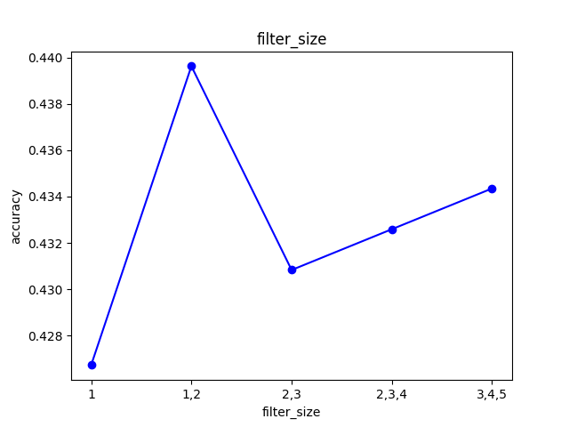

<h1 style="text-align:center">基于深度学习的文本分类</h1>

# 任务背景
手动构造神经网络和损失函数工程量大，且实现效果一般不好，在面对复杂网络结构时耗时耗力。在此任务中，将调用torch.nn封装好的模型，在训练时能很简单地前向传播、计算梯度。从而简化文本分类任务工作量。
在众多网络中，卷积神经网络能够提取局部连续特征，并压缩向量特征，可以提取连续的文本信息，同时可以选择最大池化、平均池化等方式，忽略位置捕捉文本信息，因此可以用于文本分类任务。本任务即尝试参考 https://arxiv.org/abs/1408.5882 ，使用pytorch构建CNN实现文本分类，并与RNN，Transformer进行对比

[本练习的代码仓库](https://github.com/Crnaneo/FudanNLP-Task2)
# 方法实践
## 数据读取和划分
同Task1，读取new_train.tsv，new_test.tsv的数据，并按照8：2的比例划分训练、验证集
## 词向量化
记录训练集中出现的所有单词作为词表，对文本进行tokenize，对于训练集未出现的单词，统一使用`<UNK>`进行标记。之后将所有token进行嵌入转化为向量
## 模型定义
分别定义CNN，RNN，Transformer进行任务，设置相关参数，添加正则化。CNN使用多核来捕捉更全的文本信息。RNN采用LSTM以便更好的记忆句子信息
## 训练&测试
定义损失函数，优化器，默认使用epochs=50, batch_size=64, 自适应调节学习率进行训练。每五个batch记录一次损失。在完成训练后，在测试集上对模型表现测试，记录分类准确率
# 实验设计
## 探究不同模型在该任务上的表现
CNN，RNN，Transformer都可以用于处理序列任务，且每个模型捕获的数据特征不同。CNN捕获连续词语的特征，忽略位置信息；RNN捕获序列信息，且按时间顺序传递；Transformer采用自注意力机制同时处理序列信息，避免了信息遗忘的问题。在本实验中，将综合比较三个模型在此任务的表现。
## 探究不同损失函数对模型表现的影响
在分类任务中，不同损失函数的计算结果，梯度情况不同。实验中调整不同的损失函数，看模型在不同损失函数下的收敛情况、最终表现。
但在分类任务中，未找到相比交叉熵更适合的损失函数，主要尝试解决过拟合，基于现在的交叉熵函数，增加label_smoothing标签，允许模型训练时一定程度的错误。
## 探究卷积核数量、尺寸对模型表现的影响
在CNN中，卷积核的尺寸可以让模型捕捉不同长度词语的连续特征。卷积核的数量可以让模型捕捉词语不同数量的特征。这样在池化时，模型所依据的文本特征也有所不同。实验希望通过调整参数，看这二者的变化对于该任务的影响。
# 结果分析
## 实验1
因为该任务主要是总结文本特征进行分类，Transformer选择单encoder层。
Transformer实验结果
```
Epoch:5/50, train_loss:1.4195, val_loss:1.4610
Epoch:10/50, train_loss:1.2620, val_loss:1.4445
Epoch:15/50, train_loss:1.1021, val_loss:1.5025
Epoch:20/50, train_loss:1.0031, val_loss:1.4919
Epoch:25/50, train_loss:0.8521, val_loss:1.5589
Epoch:30/50, train_loss:0.7371, val_loss:1.6381
Epoch:35/50, train_loss:0.5733, val_loss:1.8160
Epoch:40/50, train_loss:0.4666, val_loss:2.0164
Epoch:45/50, train_loss:0.3667, val_loss:2.2086
Epoch:50/50, train_loss:0.3036, val_loss:2.3731
0.44021101992966
```

CNN选择使用30个卷积核，尺寸为3,4,5
CNN实验结果
```
Epoch:5/50, train_loss:1.3940, val_loss:1.4304
Epoch:10/50, train_loss:1.2811, val_loss:1.4045
Epoch:15/50, train_loss:1.1683, val_loss:1.3870
Epoch:20/50, train_loss:1.0793, val_loss:1.3641
Epoch:25/50, train_loss:0.9900, val_loss:1.3447
Epoch:30/50, train_loss:0.9203, val_loss:1.3282
Epoch:35/50, train_loss:0.8726, val_loss:1.3214
Epoch:40/50, train_loss:0.8311, val_loss:1.3121
Epoch:45/50, train_loss:0.8108, val_loss:1.3120
Epoch:50/50, train_loss:0.7902, val_loss:1.3072
0.4320046893317702
```
RNN实验结果
```
Epoch:5/50, train_loss:1.4293, val_loss:1.4415
Epoch:10/50, train_loss:1.3165, val_loss:1.3927
Epoch:15/50, train_loss:1.1870, val_loss:1.3734
Epoch:20/50, train_loss:1.1033, val_loss:1.4213
Epoch:25/50, train_loss:0.9918, val_loss:1.4722
Epoch:30/50, train_loss:0.9359, val_loss:1.5064
Epoch:35/50, train_loss:0.8620, val_loss:1.6762
Epoch:40/50, train_loss:0.8421, val_loss:1.7312
Epoch:45/50, train_loss:0.7873, val_loss:1.7615
Epoch:50/50, train_loss:0.7768, val_loss:1.7883
0.41031652989449
```
*最后一行为测试集准确率*

三种模型均有过拟合现象，对于此现象尝试了dropout和weight_decay均不能解决问题。其中CNN的过拟合问题相对较轻。但三者最终在测试集上的表现近似，证明训练有效，但效果不显著。
# 实验2
实验基于Transformer的模型进行训练。
最终添加了label_smoothing=0.1/0.05的情况下，模型收敛情况更差，准确率约为0.413，最终训练集损失在0.4左右收敛，相比不添加label_smoothing的情况更差。
# 实验3

<p style="text-align: center;">图1：验证集准确率随filter_size的变化</p>
当卷积核尺寸为`[1,2]`的时候（只捕捉连续1，2个词的特征信息），模型表现较好，但整体差别不大，结果差异可能由于随机误差导致。推测在简单数据集上，各词出现较平均，词频和连续词语对模型表现性能影响较小。

# 总结
在实验中，过拟合情况较明显，模型能够在训练集上较好收敛，但在验证集上不收敛。可能是因为训练样本数较少而使用模型参数较多较复杂的原因，也可能是因为在tokenize的过程仅根据在训练集见过的词记入词表，因此面对未知词全当UNK处理，难以更好拟合。
三种网络处理文本信息在当前实验条件下表现相近，但效果均不太好，但CNN的损失在下降，可能能够通过提高epochs实现进一步优化。
在小数量文本训练中，卷积核尺寸对模型表现影响不大，可能因为样本较少，词语分布较平均，连续词的语义特征不太明显。

